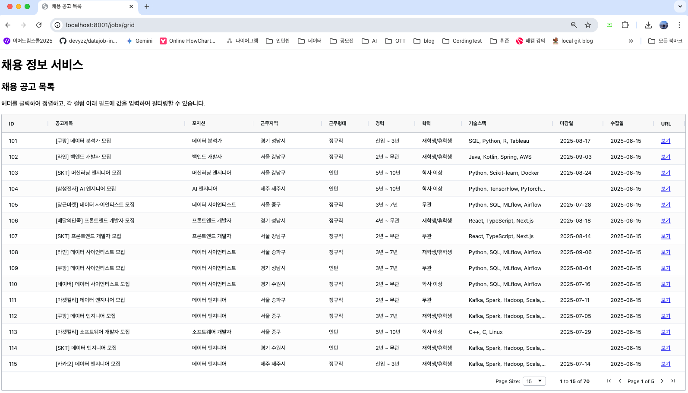

# HOW-TO-START(GRID ver)

#### 1. 현재 개발 된 영역 (~25.06.18)

- `_common`: 여러 서비스에서 공통으로 사용하는 설정, 스키마, 유틸리티 등을 모아놓은 공통 디렉토리.
- `api-service`: 데이터 조회 및 관리를 위한 핵심 API를 제공하는 서비스 디렉토리, 백엔드단. (FastAPI)
- `web-jobposting-service`: 채용 공고를 사용자에게 그리드 형태로 보여주는 서비스 디렉토리. (FastAPI, Jinja2, AGgrid)

#### 2. 기술스택
- **언어**: Python 3.11
- **웹 프레임워크**: FastAPI
- **의존성 관리**: Poetry
- **컨테이너화**: Docker, Docker Compose
- **데이터베이스**: PostgreSQL, MongoDB
#### 3. 개발 환경 설정 
Docker를 사용하여 모든 서비스의 실행환경을 완벽히 격리함. git pull을 내려받은 후 `docker compose up --build` 명령어로 간단히 실행 가능
(단, 본인 로컬환경에 도커는 설치되어있어야함)

##### 3.1 환경변수 설정 
`.env` 파일 설정 필요 
`POSTGRESQL` : 본인 로컬 DB대로 설정필요

##### 3.2 Potery 설치 
`pip install poetry`를 통해 poetry가 설치되어 있어야함

#### 4. 실행

```bash
docker compose up --build
```
- `docker-compose`에 정의된 모든 서비스의 Docker 이미지를 빌드하고, (feat/job-grid 브랜치 기준, postgre, api-service, web-jobposting-service 서비스 등록)
- 모든 컨테이너를 실행함 
##### 프로젝트 중지가 필요한 경우 
```bash
docker compose down
```

#### 5. 확인
- **API 서비스**: `http://localhost:8000/docs` 로 접속하여 API 문서를 확인
- **채용 공고 리스트**: `http://localhost:8001/jobs/grid` 로 접속하여 웹 페이지를 확인

    - 헤더정렬
    

    - 필터링
    
    
    - 페이징
    